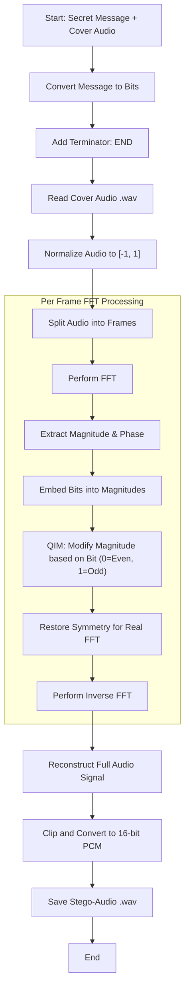
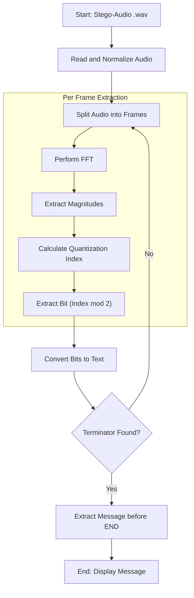

# Audio Steganography Flowchart

This project implements **Frequency-Domain Audio Steganography** using the **Fast Fourier Transform (FFT)** and **Quantization Index Modulation (QIM)**. Below are the flowcharts for the embedding and extraction processes.

## 1. Embedding Process (Hiding Data)

The embedding process converts the secret text into bits and modifies the magnitudes of specific frequency bins in the audio signal.

### Text Version: Embedding Step-by-Step
1. **Preparation**: Convert text message to bits and append the terminator `###END###`.
2. **Read Audio**: Open the `.wav` file, convert to mono, and normalize values to a range of `-1.0` to `1.0`.
3. **Framing**: Break the audio into small blocks (frames) of 1024 samples.
4. **Transform**: For each frame, perform a **Fast Fourier Transform (FFT)** to move from the time domain to the frequency domain.
5. **Separate Components**: Get the **Magnitude** (energy) and **Phase** (timing) of each frequency.
6. **Hide Data (QIM)**: 
   - Pick frequency bins between 100Hz and 300Hz.
   - If the bit to hide is **0**, adjust the magnitude so its "quantized index" is **even**.
   - If the bit to hide is **1**, adjust the magnitude so its "quantized index" is **odd**.
7. **Symmetry**: Mirror the changes to the other half of the FFT spectrum (required for real audio signals).
8. **Inversion**: Use the modified Magnitudes and original Phases to perform an **Inverse FFT (IFFT)**, turning it back into audio samples.
9. **Finalize**: Reassemble the frames, clip any values outside `-1` to `1`, convert back to standard 16-bit integer audio, and save.

---

## 2. Extraction Process (Retrieving Data)

The extraction process reads the stego-audio, analyzes the frequency magnitudes, and reconstructs the original message until the terminator is found.

### Text Version: Extraction Step-by-Step
1. **Read Stego-Audio**: Open the modified `.wav` file and normalize it.
2. **Framing**: Break the audio into 1024-sample frames (same as embedding).
3. **Transform**: For each frame, perform an **FFT**.
4. **Analyze Magnitudes**: 
   - Look at the frequency bins (100Hz - 300Hz).
   - Divide the magnitude by the "step" value to find the index.
   - If the index is **Even**, the bit is **0**.
   - If the index is **Odd**, the bit is **1**.
5. **Reconstruct Message**: Group every 8 bits to form characters.
6. **Detection**: Keep extracting until the `###END###` string is detected in the recovered text.
7. **Result**: Stop processing and display the text found before the terminator.

## Technical Details

- **Algorithm**: Quantization Index Modulation (QIM) in DFT domain.
- **Frequency Range**: Mid-frequencies (100 - 300 Hz bins) are used to balance robustness and imperceptibility.
- **Frame Size**: 1024 samples.
- **Robustness**: Using magnitudes instead of phases makes the data more resistant to small phase shifts, though it remains sensitive to heavy compression (like MP3).
