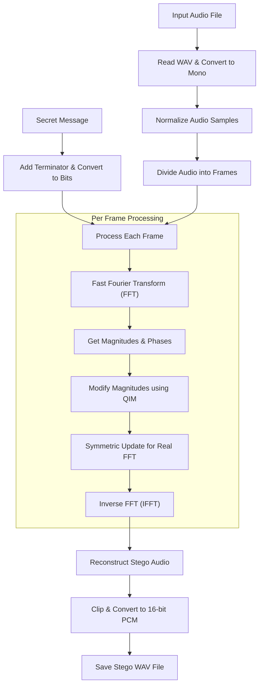
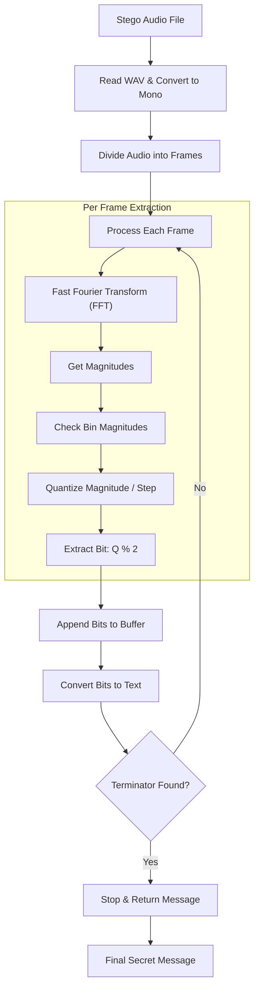
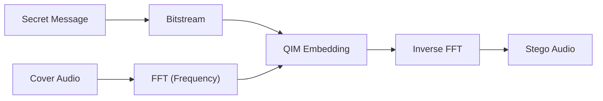

# Audio Steganography: Core Processes

This document provides a visual representation of how the FFT-based audio steganography system embeds and extracts messages.

## 1. Embedding Process

The embedding process uses **Quantization Index Modulation (QIM)** in the frequency domain.

---

## 2. Extraction Process

The extraction process reverses the quantization to retrieve the bitstream.

## Presentation Slides (Concise Versions)

These simplified diagrams are designed for presentation slides to highlight the core high-level logic.

### Embedding (Simplified)

### Extraction (Simplified)

## Key Technologies
- **FFT (Fast Fourier Transform):** Transitions audio from time domain to frequency domain.
- **QIM (Quantization Index Modulation):** Encodes bits by forcing frequency magnitudes to even or odd multiples of a quantization step.
- **Complexity:** Minimal audible distortion by targeting mid-range frequencies.
